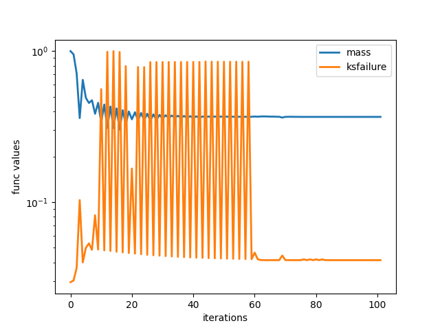
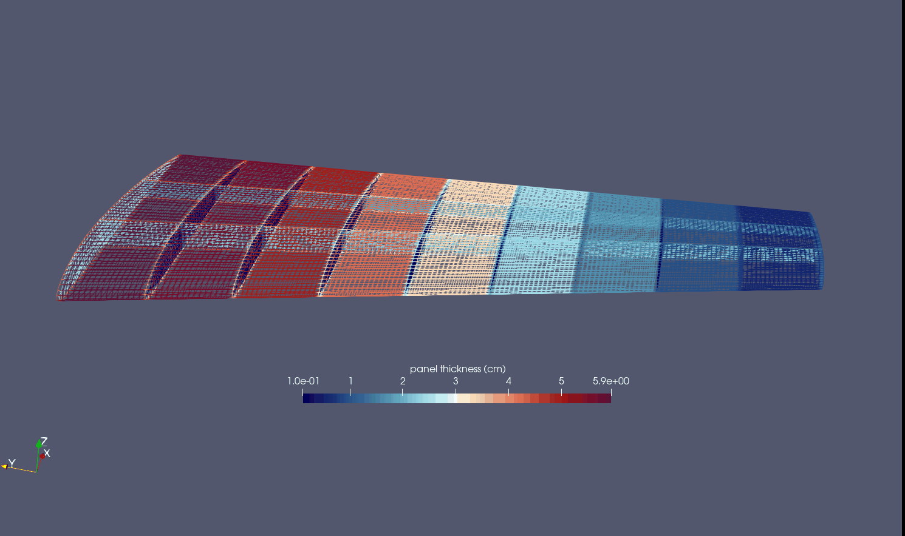
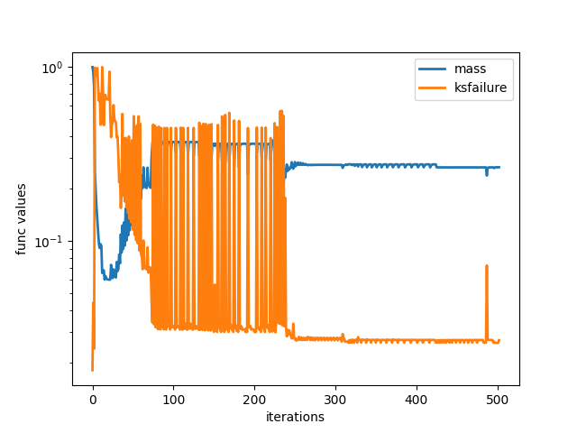

Installation of ESP/CAPS
************************
The link to the main Engineering Sketch Pad webiste is the following, `ESP/CAPS <https://acdl.mit.edu/ESP/>`_.
A prebuilt distribution can be found in the ``PreBuilts/`` folder. The following environment variables must be setup in the ~/.bashrc file.
The serveCSM command is useful in viewing the ESP/CAPS geometry from a .csm file. The alias csm
can be useful if one is running ``serveCSM`` command repeatedly (optional). Note the ``source *`` command
won't work until after the full install so you can ignore that if you source it immediately.
::

   export ESP_ROOT=~/packages/ESP123/EngSketchPad
   export PYTHONPATH=${PYTHONPATH}:$ESP_ROOT/pyESP
   source $ESP_ROOT/ESPenv.sh
   alias csm='$ESP_ROOT/bin/serveCSM'

The installation on a Linux machine proceeds as follows. Note if the ESP/OpenCASCADE version changes
past ESP123, change the bashrc and install commands accordingly. The basic steps involve downloading the tar,
unpacking it, and informing ESP/CAPS of the location of the OpenCASCADE directory (which comes with the prebuilt).
Then, as the package is a prebuilt, we only need to make the tacsAIM directory which is not usually auto-built
(don't need to make the rest of the source folder).

::

   mkdir ~/packages/ && cd ~/packages/
   wget https://acdl.mit.edu/ESP/PreBuilts/ESP123-linux-aarch64.tgz
   tar -xvf *.tgz
   cd ./ESP123/EngSketchPad/config/
   ./makeEnv ~/packages/ESP123/OpenCASCADE-7.7.0/
   cd src/CAPS/aim/tacs/
   make

The caps2tacs python module will not be imported unless ESP/CAPS is properly installed on your machine.

Intro
*****
The differentiable CAD geometry in ESP/CAPS is defined in a CSM or Computational Solid Model file.
The user must write their own CSM file (see ESP/CAPS tutorials on their website) to define a structures geometry.
Important things to include in your CSM file are included below (for reference see the file ``examples/caps_wing/simple_naca_wing.csm``).

* Configuration parameters such as ``cfgpmtr nribs 10`` which are integer variables usually fixed during optimization.
* Design parameters such as ``despmtr span 10`` which are real number variables that can be tied to a TACS shape variable.
* ``capsGroup`` attributes define regions of the geometry with the same property cars, denoted ``capsGroup $rib1``, etc. 
    We often use pattern statements to define these, and sometimes a user-defined primitive ``udprim editAttr``.
* ``capsConstraint`` attributes define regions of the geometry intended to have the same structural constraints, e.g. ``capsConstraint fix``. 
    These constraints include Temperature and elastic constraints as of right now.
* ``capsLoad`` attributes define regions of the geometry with the same fixed loads. 
    This is useful in simple structural analyses. Note that aerodynamic loads cannot be setup this way (see the funtofem github for how to do this).
* ``capsAIM`` attribute - this specifies for a body the analysis tools or AIMs using this CSM file. 
    Note that we often add the ``tacsAIM, egadsTessAIM`` here for structural analyses. 
* Occasionally ``capsMesh`` attribute - which can be used to set alternative auto-mesh settings on different sections of the geometry.

The main ``TacsModel`` object supervises the process of TACS analysis and geometry updates for optimization.
Caps2tacs supports MPI / parallel processing which is a feature not directly available in ESP/CAPS.

.. code-block:: python

   comm = MPI.COMM_WORLD
   tacs_model = caps2tacs.TacsModel.build(csm_file="simple_naca_wing.csm", comm=comm)

Next, the user must specify the auto mesh generation settings for the structure geometry that will be
used in the TACS analysis. The global mesh size depends on the scale of the model. You'll want to tune these auto-mesh
hyperparameters by running a small analysis / using egadsAIM view routine until you get a quality mesh.

.. code-block:: python

   tacs_model.mesh_aim.set_mesh(
      edge_pt_min=15,
      edge_pt_max=20,
      global_mesh_size=0.25,
      max_surf_offset=0.01,
      max_dihedral_angle=15,
   ).register_to(tacs_model)

There are certain objects that must be setup and registered to the tacs model before running a TACS analysis.
If these are not correctly specified, then the tacs model will throw an error in the setup check phase.

* Material properties - you must setup one or more material objects for use in the element property definitions. 
   Available material types include Isotropic and Orthotropic (Anisotropic can be added directly through the underlying tacsAIM). Several common materials are saved as class methods such as aluminum, steel, titanium, carbon fiber.
* Element Properties - currently caps2tacs only supports shell elements for use in aerodynamic structures. 
   Element properties can be setup directly through a `ShellProperty` object or indirectly through the `ThicknessVariable` object. 
   The names of shell properties or the thickness variables must be tied to a `capsGroup` setup in the CSM file.
* Constraints - elastic and thermal constraints are available in caps2tacs. Common instances are the ``PinConstraint`` and ``TemperatureConstraint``.
   The name/capsConstraint input to these constraint objects must match the ``capsConstraint`` attributes in the CSM file.
* Loads - for static problems ``GridForce`` and ``Pressure`` load objects are available whose names must match the ``capsLoad`` attributes.
   Note that for aerodynamic structures only coupling with a CFD software such as through the ``FUNtoFEM repo (see below`` can setup aerodynamic loads.
* Output Functionals for optimization - functionals such as ``ksfailure``, ``mass``, ``temperature``, ``compliance``
   are available for use in structural optimizations.

Once all of the above structural analysis setup objects are provided, the TacsModel is ready for analysis. You can
then run the setup method which completes the setup phase. Then, the routines ``pre_analysis()`` generates a mesh, 
the routine ``run_analysis`` runs the structural analysis and writes output solution files.
Finally the routine ``post_analysis()`` saves output functional values and derivatives using the adjoint method for optimization.

.. code-block:: python

   tacs_model.setup(include_aim=True)
   tacs_model.pre_analysis()
   tacs_model.run_analysis()
   tacs_model.post_analysis()

Examples
********
The main caps2tacs example is in the directory ``./examples/caps_wing/``, with five analyses
on a coarse mesh of a symmetric NACA 0012 wing structure. 
1. A steady analysis, using the EGADS AIM for meshing, with a vertical distributed load.
2. An unsteady analysis with a vertical distributed load varying sinusoidally in time.
3. A sizing optimization which finds the optimal panel thicknesses to hold fixed aero loads.
4. A sizing and shape optimization which optimizes the panel thicknesses and location of ribs
    and spars inside the wing to hold fixed aero loads.
5. A steady analysis, using the AFLR AIM for meshing, with a vertical distributed load.

The sizing optimization shown below resulted in about a 40\% drop in weight from the equal thickness design. Notice 
the optimal design has the largest panel thicknesses near the root as this is related to a beam bending problem
with clamped root.

The optimization results for the sizing + shape optimization are shown below, which resulted in a 27\% drop in weight
from the optimal design of the sizing optimization. This suggests that the placement of ribs and spars is very important 
in designing a good wing structure. In this case, the spars move towards the leading edge with higher curvature.

.. image:: images/c2tacs4.png
   :width: 400
   :alt: Optimal design from the sizing + shape optimization, notice the optimal placement of ribs and spars to hold the vertical distributed loads.

For more examples using caps2tacs for thermoelastic analysis and involving CFD, please see the 
`FUNtoFEM github <https://github.com/smdogroup/funtofem/>`_.

Testing
*******
Two different unittests can be used to verify your build of ESP/CAPS and TACS is working correctly. The unittests
are located at ``tests/integration_tests/test_caps_shape_derivatives.py`` and ``tests/integration_tests/test_caps_thick_derivatives.py``.