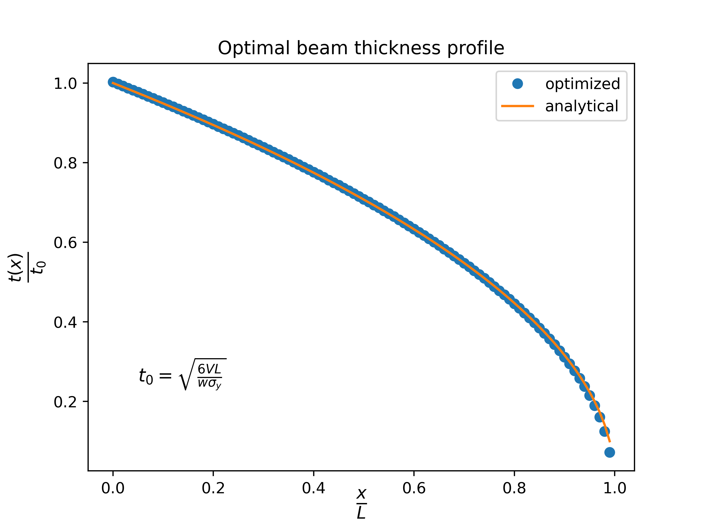

Beam optimization with MPhys
****************************
.. note:: The script for this example can be found under the `examples/beam/` directory.

This example demonstrates TACS structural optimization capabilities.
The optimization is setup using TACS' :ref:`mphys/mphys:MPhys` module, which acts as a wrapper
for OpenMDAO.
The beam model that we will be using for this problem is a rectangular beam,
cantilevered, with a shear load applied at the tip. The beam is discretized using
100 beam elements along it's span.

The optimization problem is as follows:
Minimize the mass of the beam with respect to the thickness of each element,
subject to a max stress constraint dictated by the materials yield stress.

.. image:: images/beam_prob.png
  :width: 800
  :alt: Beam problem

By realizing that the stress at any spanwise cross-section in the beam as a function of the running moment
can be found independently using:

.. math::
    \sigma(x,y) = y \frac{M(x)}{I}

An analytical solution for this problem can be shown to be:

.. math::
    t(x) = \sqrt{\frac{6V\cdot(L-x)}{w\sigma_y}}

First, we import required libraries, define the model bdf file, and define important problem constants:

.. code-block:: python

  import os

  import matplotlib.pyplot as plt
  import numpy as np
  import openmdao.api as om
  from mphys import Multipoint
  from mphys.scenario_structural import ScenarioStructural

  from tacs import elements, constitutive, functions
  from tacs.mphys import TacsBuilder

  # BDF file containing mesh
  bdf_file = os.path.join(os.path.dirname(__file__), "beam_opt.bdf")

  # Beam thickness (initial)
  t = 0.05  # m
  # Beam width
  w = 0.05  # m
  # Length of beam
  L = 1.0

  # Material properties
  rho = 2500.0  # density kg/m^3
  E = 70.0e9  # Young's modulus (Pa)
  nu = 0.0  # Poisson's ratio
  ys = 350e6  # yield stress

  # Shear force applied at tip
  V = 1e3

Next we define an :func:`~tacs.pytacs.elemCallBack` function.
This is a user-defined callback function for setting up TACS elements and element design variables.
We use the :class:`~tacs.constitutive.IsoRectangleBeamConstitutive` class for the constitutive properties,
assign a design variable number for the thickness parameter, and return a :class:`~tacs.elements.Beam2` element class.

.. code-block:: python

  # Callback function used to setup TACS element objects and DVs
  def element_callback(dvNum, compID, compDescript, elemDescripts, specialDVs, **kwargs):
      # Setup (isotropic) property and constitutive objects
      prop = constitutive.MaterialProperties(rho=rho, E=E, nu=nu, ys=ys)
      # Set one thickness dv for every property group
      con = constitutive.IsoRectangleBeamConstitutive(prop, t=t, w=w, tNum=dvNum)

      # Defines local y/thickness direction for beam
      refAxis = np.array([0.0, 1.0, 0.0])
      transform = elements.BeamRefAxisTransform(refAxis)

      # Pass back the appropriate tacs element object
      elem = elements.Beam2(transform, con)
      return elem

We define a :func:`problem_setup` function.
This function is called each time a new MPhys Scenario is created.
This function sets up the :class:`~tacs.problems.StaticProblem` by adding fixed loads, modifying options, and adding eval functions.
Here we specify the beam mass (:class:`~tacs.functions.StructuralMass`) and aggregated failure (:class:`~tacs.functions.KSFailure`) as outputs for our analysis and add our 1 kN shear load.

.. code-block:: python

  def problem_setup(scenario_name, fea_assembler, problem):
      """
      Helper function to add fixed forces and eval functions
      to structural problems used in tacs builder
      """

      # Add TACS Functions
      problem.addFunction("mass", functions.StructuralMass)
      problem.addFunction(
          "ks_vmfailure", functions.KSFailure, safetyFactor=1.0, ksWeight=100.0
      )

      # Add forces to static problem
      problem.addLoadToNodes(101, [0.0, V, 0.0, 0.0, 0.0, 0.0], nastranOrdering=True)

Here we define our :class:`~mphys.Multipoint` (essentially an OpenMDAO ``Group``) which will contain our analysis :class:`~mphys.Scenario`.
To do this, we instantiate the :class:`~tacs.mphys.builder.TacsBuilder` using the ``element_callback`` and ``problem_setup`` we defined above.
We create OpenMDAO ``Component``'s to feed design variable and mesh inputs to the ``Scenario`` component.
We use this builder to create an MPhys :class:`~mphys.StructuralScenario`.

.. code-block:: python

  class BeamModel(Multipoint):
      def setup(self):
          # Initialize MPHYS builder for TACS
          struct_builder = TacsBuilder(
              mesh_file=bdf_file,
              element_callback=element_callback,
              problem_setup=problem_setup,
              coupled=False,
              write_solution=False,
          )
          struct_builder.initialize(self.comm)
          dv_array = struct_builder.get_initial_dvs()

          # Create independent variable component to control design variables for problem
          dvs = self.add_subsystem("dvs", om.IndepVarComp(), promotes=["*"])
          dvs.add_output("dv_struct", dv_array)

          # Add mesh component
          self.add_subsystem("mesh", struct_builder.get_mesh_coordinate_subsystem())
          self.mphys_add_scenario(
              "tip_shear", ScenarioStructural(struct_builder=struct_builder)
          )
          self.mphys_connect_scenario_coordinate_source("mesh", "tip_shear", "struct")

          # Connect dv component to input of structural scenario
          self.connect("dv_struct", "tip_shear.dv_struct")

At this point we setup the OpenMDAO ``Problem`` class that we will use to perform our optimization.
We assign our ``BeamModel`` to the problem class and set ``ScipyOptimizeDriver``.
We define our design variables, constraint, and objective.
Finally we run the problem driver to optimize the problem.

.. code-block:: python

  # Instantiate OpenMDAO problem
  prob = om.Problem()
  prob.model = BeamModel()
  model = prob.model

  # Declare design variables, objective, and constraint
  model.add_design_var("dv_struct", lower=0.001, upper=0.1, scaler=100.0)
  model.add_objective("tip_shear.mass", scaler=1.0)
  model.add_constraint("tip_shear.ks_vmfailure", lower=0.0, upper=1.0, scaler=1.0)

  # Configure optimizer
  prob.driver = om.ScipyOptimizeDriver(debug_print=["objs", "nl_cons"], maxiter=1000)
  prob.driver.options["optimizer"] = "SLSQP"

  # Setup OpenMDAO problem
  prob.setup()

  # Output N2 representation of OpenMDAO model
  om.n2(prob, show_browser=False, outfile="beam_opt_n2.html")

  # Run optimization
  prob.run_driver()

After the optimization completes the user should see a print out to screen like shown below.

>>> Optimization terminated successfully    (Exit mode 0)
>>>             Current function value: 1.5534716448382722
>>>             Iterations: 138
>>>             Function evaluations: 372
>>>             Gradient evaluations: 138
>>> Optimization Complete
>>> -----------------------------------

Once the optimization is complete we can post-process results.
We can write our optimized beam model to a BDF file so they can
be processed in other commonly used FEM software.
The ``f5`` solution file at each optimization iteration can also be converted to a Tecplot or Paraview files using ``f5totec`` or ``f5tovtk``, respectively.

.. code-block:: python

  # Write optimized structure to BDF
  bdf_out = os.path.join(os.path.dirname(__file__), "beam_sol.bdf")
  prob.model.tip_shear.coupling.write_bdf(bdf_out)

Finally, we can plot the optimized thickness distribution using matplotlib and compare against the expected optimal result from beam theory.

.. code-block:: python

  # Get optimized solution variables
  x = prob.get_val("mesh.x_struct0", get_remote=True)[:-3:3]
  t_opt = prob["dv_struct"]
  m_opt = prob["tip_shear.mass"]

  # Get analytical solution
  t_exact = np.sqrt(6 * (L - x) * V / w / ys)

  # Compute max thickness value
  t0 = np.sqrt(6 * L * V / w / ys)

  # Plot results for solution
  plt.plot(x / L, t_opt / t0, "o", x, t_exact / t0)
  plt.legend(["optimized", "analytical"])
  plt.ylabel(r"$\frac{t(x)}{t_0}$", fontsize=16)
  plt.xlabel(r"$\frac{x}{L}$", fontsize=16, labelpad=-5)
  plt.title("Optimal beam thickness profile")
  plt.text(0.05, 0.25, r"$t_0 = \sqrt{\frac{6VL}{w\sigma_y}}$", fontsize=12)
  plt.show()

