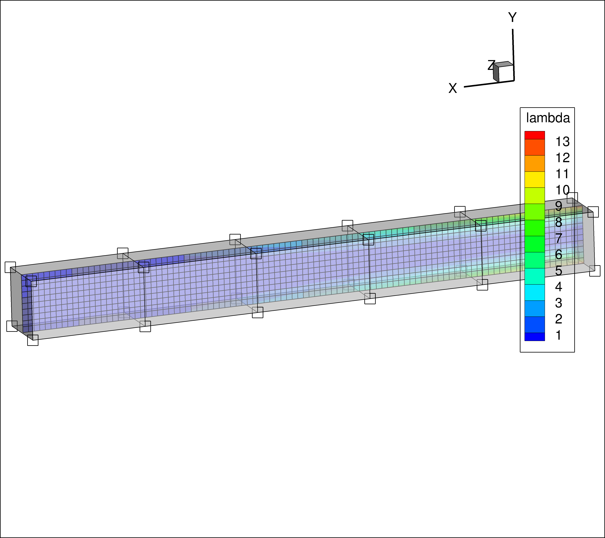
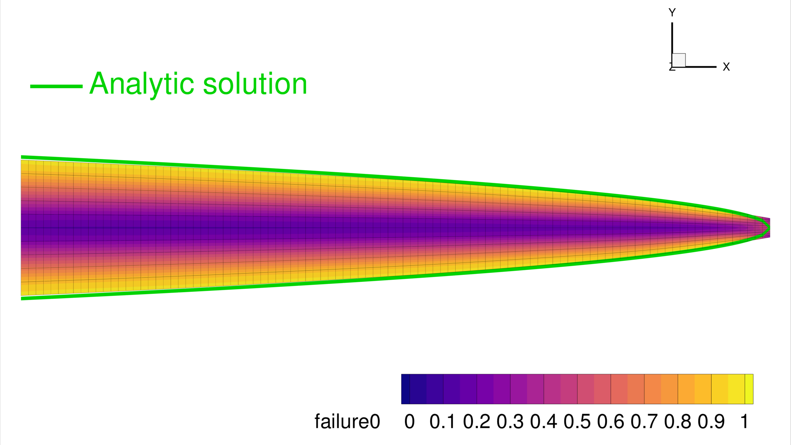

2D Beam Shape Optimization with MACH
************************************
.. note:: The script for this example can be found under the ``examples/beam/shape_opt.py`` file.

This example demonstrates TACS structural shape optimization using the
:ref:`mach/mach:MACH` interface.
It considers the same cantilevered beam with a tip shear load as the
:ref:`examples/Example-Beam_Optimization:Beam optimization with MPhys` example, but differs
in two key ways: the beam is modeled in 2D using shell elements rather than 1D beam elements,
and the geometry is optimized by physically warping the finite-element mesh via a free-form deformation (FFD) volume
rather than by adjusting 1D cross-sectional properties.
The beam is discretized using 1001 shell elements along its span and depth.

The optimization problem is:

  **Minimize** the mass of the beam with respect to the depth of the cross-section along the span,
  subject to a maximum stress constraint dictated by the material's yield stress.

In order to change the shape of the FEM, we use a FFD volume
parameterization scheme provided by the `pyGeo <https://github.com/mdolab/pygeo>`_ library.
TACS :ref:`mach/mach:MACH` module is used to link the static problem with pyGeo's FFD volume parameterization.

The figure below shows the initial (unoptimized) beam with the von Mises failure contour and
the FFD box with its control points encapsulating the structure:

Each spanwise control point section will be parameterized in such a way that the depth of the beam can be optimized at each station.

As was shown in :ref:`examples/Example-Beam_Optimization:Beam optimization with MPhys` example an analytic solution for the optimal spanwise depth profile can be derived and is given below:

.. math::
    d(x) = \sqrt{\frac{6 V (L - x)}{t \, \sigma_y}}

The optimization will be driven by SLSQP via pyoptsparse, with gradients supplied by
TACS' adjoint solver through the :class:`~tacs.mach.struct_problem.StructProblem` wrapper.

First, import required libraries:

.. code-block:: python

  import numpy as np
  import os

  from pygeo import DVGeometry
  from pyoptsparse import Optimization, OPT

  from tacs.mach import StructProblem
  from tacs import pyTACS
  from tacs import elements, constitutive, functions

Next, define the problem parameters and file paths:

.. code-block:: python

  bdf_file = os.path.join(os.path.dirname(__file__), 'Slender_Beam.bdf')
  ffd_file = os.path.join(os.path.dirname(__file__), 'ffd_8_linear.fmt')

  # Beam thickness
  t = 0.01 # m
  # Length of beam
  L = 1.0 # m

  # Material properties
  rho = 2780.0 # kg /m^3
  E = 70.0e9 # Pa
  nu = 0.0
  ys = 420.0e6

  # Shear force applied at tip
  V = 2.5E4 # N

Now, define the element callback function used to setup TACS element objects and design variables:

.. code-block:: python

  def element_callback(dvNum, compID, compDescript, elemDescripts, specialDVs, **kwargs):
      # Setup (isotropic) property and constitutive objects
      prop = constitutive.MaterialProperties(rho=rho, E=E, nu=nu, ys=ys)
      con = constitutive.IsoShellConstitutive(prop, t=t, tNum=-1)
      # TACS shells are sometimes a little overly-rigid in shear
      # We can reduce this effect by decreasing the drilling regularization
      con.setDrillingRegularization(0.1)
      refAxis = np.array([1.0, 0.0, 0.0])
      transform = elements.ShellRefAxisTransform(refAxis)
      elem = elements.Quad4Shell(transform, con)
      return elem

Create and initialize the pyTACS assembler:

.. code-block:: python

  FEAAssembler = pyTACS(bdf_file)
  FEAAssembler.initialize(element_callback)

Set up the FFD and geometric design variables using `pyGeo <https://github.com/mdolab/pygeo>`_'s DVGeometry:

.. code-block:: python

  DVGeo = DVGeometry(fileName=ffd_file)
  # Create reference axis
  nRefAxPts = DVGeo.addRefAxis(name="centerline", alignIndex='i', yFraction=0.5)

  # Set up global design variables
  def depth(val, geo):
      for i in range(nRefAxPts):
          geo.scale_y["centerline"].coef[i] = val[i]

  DVGeo.addGlobalDV(dvName="depth", value=np.ones(nRefAxPts), func=depth,
                    lower=1e-3, upper=10.0, scale=20.0)

Create the static problem and add functions of interest:

.. code-block:: python

  staticProb = FEAAssembler.createStaticProblem("tip_shear")
  # Add TACS Functions
  staticProb.addFunction('mass', functions.StructuralMass)
  staticProb.addFunction('ks_vmfailure', functions.KSFailure, safetyFactor=1.0, ksWeight=100.0)
  # Add forces to static problem
  staticProb.addLoadToNodes(1112, [0.0, V, 0.0, 0.0, 0.0, 0.0], nastranOrdering=True)

Wrap the static problem with the :class:`~tacs.mach.struct_problem.StructProblem` using the MACH interface.
Passing ``DVGeo`` here registers the structural node coordinates with the FFD volume;
nodes are updated automatically before each solve when design variables change:

.. code-block:: python

  structProb = StructProblem(staticProb, FEAAssembler, DVGeo=DVGeo)

Define the objective and constraint evaluation function:

.. code-block:: python

  def structObj(x):
      """Evaluate the objective and constraints"""
      funcs = {}
      structProb.setDesignVars(x)
      DVGeo.setDesignVars(x)
      structProb.solve()
      structProb.evalFunctions(funcs)
      structProb.writeSolution()
      if structProb.comm.rank == 0:
          print(x)
          print(funcs)

      return funcs, False

Define the sensitivity evaluation function.
:meth:`~tacs.mach.struct_problem.StructProblem.evalFunctionsSens` folds in the DVGeo
chain-rule term automatically, producing sensitivities keyed by the geometric DV name
(``"depth"``).  The structural DV sensitivity (keyed ``"struct"``) is
popped out because it is not used in the pyoptsparse optimization problem:

.. code-block:: python

  def structSens(x, funcs):
      """Evaluate the objective and constraint sensitivities"""
      funcsSens = {}
      structProb.evalFunctionsSens(funcsSens)
      for func in funcsSens:
          funcsSens[func].pop("struct")
      return funcsSens, False

Set up the optimization problem using pyoptsparse.
:meth:`~tacs.mach.struct_problem.StructProblem.addVariablesPyOpt` registers the TACS
structural design variables (none in this case, since ``tNum=-1``), and
``DVGeo.addVariablesPyOpt`` registers the FFD ``"depth"`` DVs.
The stress constraint is added as a nonlinear inequality using the KS failure aggregation:

.. code-block:: python

  # Now we create the structural optimization problem:
  optProb = Optimization("Mass min", structObj)
  optProb.addObj("tip_shear_mass")
  structProb.addVariablesPyOpt(optProb)
  DVGeo.addVariablesPyOpt(optProb)
  optProb.addCon("tip_shear_ks_vmfailure", upper=1.0)

  optProb.printSparsity()

  opt = OPT("SLSQP", options={"MAXIT": 100, "IPRINT": 1, "IFILE": os.path.join(os.path.dirname(__file__), 'SLSQP.out')})

Finally, run the optimization:

.. code-block:: python

  # Finally run the actual optimization
  sol = opt(optProb, sens=structSens, storeSens=False)

Results
-------

The optimization minimizes the beam mass while keeping the KS failure index below 1.0.
The converged depth profile decreases from root to tip, matching the analytical solution
:math:`d(x) = \sqrt{6V(L-x)/(t\,\sigma_y)}`.

