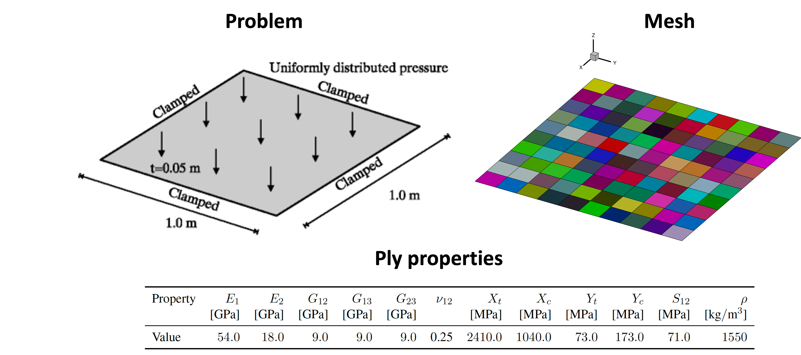
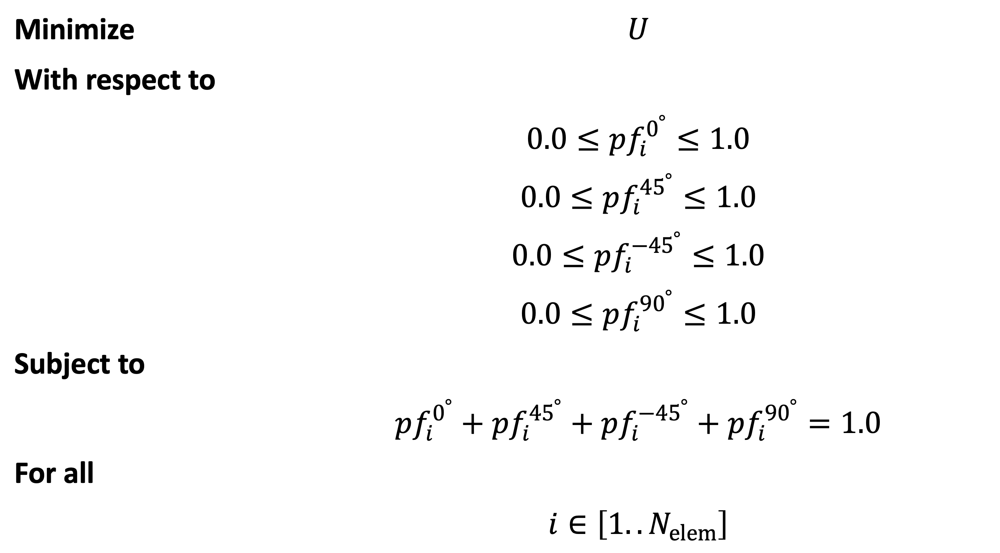
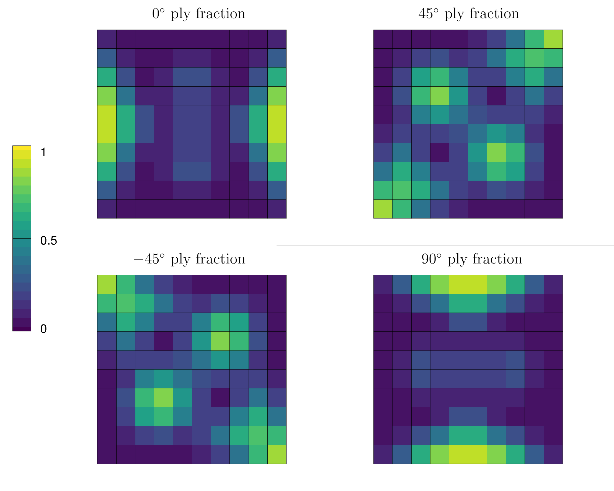

Composite plate optimization with MPhys
***************************************
.. note:: The script for this example can be found under the `examples/plate/` directory.

This example further demonstrates TACS structural optimization capabilities through :ref:`mphys/mphys:MPhys`.
In this example a compliance minimization problem for a composite plate, based off of one originally proposed by Lund and Stegmann [`1`_], is solved.
A 1 m x 1 m x 0.05 m composite plate is clamped on all edges and subjected to
a uniform pressure of 100 kPa loading on the top.
The plate is discretized into 100 quad shell elements, each having its own independent laminate layup.
The goal of this example will be to optimize the layup of each element in the plate in order to minimize the total compliance energy.
A diagram of the problem is shown below.

To make this problem tractable for gradient-based optimization we will make the following simplifications:

  1. For each layup we can ony select plies of the following angles: :math:`0^\circ, 45^\circ, -45^\circ, 90^\circ`.

  2. We will neglect the discrete nature of the plies and the effects of stacking sequence. Instead, we homogenize or "smear" each ply angle's contribution to laminate stiffness based on its proportion of plies in the layup or "ply fraction".

The optimization problem can now be summarized as follows:

To begin we first import required libraries, define the model bdf file, and define important problem constants:

.. code-block:: python

  import os

  import openmdao.api as om
  import numpy as np
  from mphys.core import Multipoint
  from mphys.scenarios import ScenarioStructural

  from tacs import elements, constitutive, functions
  from tacs.mphys import TacsBuilder

  # BDF file containing mesh
  bdf_file = os.path.join(os.path.dirname(__file__), "partitioned_plate.bdf")

  # Material properties
  rho = 1550.0
  E1 = 54e9
  E2 = 18e9
  nu12 = 0.25
  G12 = 9e9
  G13 = 9e9
  Xt = 2410.0e6
  Xc = 1040.0e6
  Yt = 73.0e6
  Yc = 173.0e6
  S12 = 71.0e6

  # Shell thickness
  ply_thickness = 1.25e-3  # m
  plate_thickness = 0.05  # m
  tMin = 0.002  # m
  tMax = 0.05  # m

  # Ply angles/initial ply fractions
  ply_angles = np.deg2rad([0.0, 45.0, -45.0, 90.0])
  ply_fractions = np.array([0.25, 0.25, 0.25, 0.25])

  # Pressure load to apply to plate
  P = 100e3

Next, we define an ``element_callback`` function for setting up the TACS elements and design variables.
We use the :class:`~tacs.constitutive.SmearedCompositeShellConstitutive` class here for the constitutive properties, and
assign four design variable numbers to each element (one for each ply fraction), and return a :class:`~tacs.elements.Quad4Shell` element class.

.. code-block:: python

  # Callback function used to setup TACS element objects and DVs
  def element_callback(dvNum, compID, compDescript, elemDescripts, specialDVs, **kwargs):
      # Create ply object
      ortho_prop = constitutive.MaterialProperties(
          rho=rho,
          E1=E1,
          E2=E2,
          nu12=nu12,
          G12=G12,
          G13=G13,
          G23=G13,
          Xt=Xt,
          Xc=Xc,
          Yt=Yt,
          Yc=Yc,
          S12=S12,
      )
      ortho_ply = constitutive.OrthotropicPly(ply_thickness, ortho_prop)
      # Create the layup list (one for each angle)
      ortho_layup = [ortho_ply, ortho_ply, ortho_ply, ortho_ply]
      # Assign each ply fraction a unique DV
      ply_fraction_dv_nums = np.array(
          [dvNum, dvNum + 1, dvNum + 2, dvNum + 3], dtype=np.intc
      )
      # Create smeared stiffness object based on ply angles/fractions
      con = constitutive.SmearedCompositeShellConstitutive(
          ortho_layup,
          plate_thickness,
          ply_angles,
          ply_fractions,
          ply_fraction_dv_nums=ply_fraction_dv_nums,
      )

      # Define reference axis to define local 0 deg direction
      refAxis = np.array([1.0, 0.0, 0.0])
      transform = elements.ShellRefAxisTransform(refAxis)

      # Pass back the appropriate tacs element object
      elem = elements.Quad4Shell(transform, con)

      return elem

We define a ``problem_setup`` to add fixed loads and eval functions.
Here we specify the plate compliance energy (:class:`~tacs.functions.Compliance`) as an output for our analysis
and add our 100 kPa pressure load.

.. code-block:: python

  def problem_setup(scenario_name, fea_assembler, problem):
      """
      Helper function to add fixed forces and eval functions
      to structural problems used in tacs builder
      """

      # Add TACS Functions
      problem.addFunction("compliance", functions.Compliance)

      # Add forces to static problem
      allComponents = fea_assembler.selectCompIDs()
      problem.addPressureToComponents(allComponents, P)

For our last helper function we define a ``constraint_setup`` function.
This function can be used to add additional relational constraints to the design variables we defined in the ``element_callback``.
In particular, we want to enforce a new constraint (100 in total) such that the ply fractions within each element should sum to unity.
We can accomplish this by utilizing the :class:`~tacs.constraints.DVConstraint` class.

.. code-block:: python

  def constraint_setup(scenario_name, fea_assembler, constraint_list):
      """
      Helper function to setup tacs constraint classes
      """
      constr = fea_assembler.createDVConstraint("ply_fractions")
      allComponents = fea_assembler.selectCompIDs()
      constr.addConstraint(
          "sum", allComponents, dvIndices=[0, 1, 2, 3], dvWeights=[1.0, 1.0, 1.0, 1.0]
      )
      constraint_list.append(constr)

Fianlly, we define our :class:`~mphys.Multipoint` class.
To do this, we instantiate the :class:`~tacs.mphys.builder.TacsBuilder` using the ``element_callback``, ``problem_setup``, and ``constraint_setup`` we defined above.
We create OpenMDAO ``Component``'s to feed design variable and mesh inputs to the ``Scenario`` component.
We use this builder to create an MPhys :class:`~mphys.StructuralScenario`.

.. code-block:: python

  class PlateModel(Multipoint):
      def setup(self):
          struct_builder = TacsBuilder(
              mesh_file=bdf_file,
              element_callback=element_callback,
              problem_setup=problem_setup,
              constraint_setup=constraint_setup,
              check_partials=True,
          )
          struct_builder.initialize(self.comm)
          dv_array = struct_builder.get_initial_dvs()

          dvs = self.add_subsystem("dvs", om.IndepVarComp(), promotes=["*"])
          dvs.add_output("dv_struct", dv_array)

          self.add_subsystem("mesh", struct_builder.get_mesh_coordinate_subsystem())
          self.mphys_add_scenario(
              "pressure_load", ScenarioStructural(struct_builder=struct_builder)
          )
        self.connect(
            f"mesh.{MPhysVariables.Structures.Mesh.COORDINATES}",
            f"pressure_load.{MPhysVariables.Structures.COORDINATES}",
        )

          self.connect("dv_struct", "pressure_load.dv_struct")

At this point we setup the OpenMDAO ``Problem`` class that we will use to perform our optimization.
We assign our ``PlateModel`` to the problem class and set ``ScipyOptimizeDriver``.
We define our design variables, constraint, and objective.
Finally, we run the problem driver to optimize the problem.

.. code-block:: python

  prob = om.Problem()
  prob.model = PlateModel()
  model = prob.model

  # Declare design variables, objective, and constraint
  model.add_design_var("dv_struct", lower=0.0, upper=1.0)
  model.add_objective("pressure_load.compliance")
  model.add_constraint("pressure_load.ply_fractions.sum", equals=1.0, linear=True)

  # Configure optimizer
  prob.driver = om.ScipyOptimizeDriver(debug_print=["objs", "nl_cons"], maxiter=100)
  prob.driver.options["optimizer"] = "SLSQP"

  # Setup OpenMDAO problem
  prob.setup()

  # Output N2 representation of OpenMDAO model
  om.n2(prob, show_browser=False, outfile="tacs_struct.html")

  # Run optimization
  prob.run_driver()

After the optimization completes the user should see a print out to screen like shown below.

>>> Optimization terminated successfully    (Exit mode 0)
>>>             Current function value: 8.571649588963465
>>>             Iterations: 34
>>>             Function evaluations: 34
>>>             Gradient evaluations: 34
>>> Optimization Complete
>>> -----------------------------------

Once the optimization is complete we can post-process results.
The ``f5`` solution file at each optimization iteration can also be converted to a Tecplot or Paraview files using ``f5totec`` or ``f5tovtk``, respectively.
The optimized ply fraction distributions for each angle can be visualized by plotting the contours of the following variables in Tecplot or Paraview: ``dv2``, ``dv3``, ``dv4``, ``dv5``.
A visualization of the optimized result is shown below:

.. rubric:: References

.. [1] Lund, E. and Stegmann, J., “On structural optimization of composite shell structures using a discrete constitutive parametrization,” Wind Energy, Vol. 8, No. 1, 2005, pp. 109–124.

