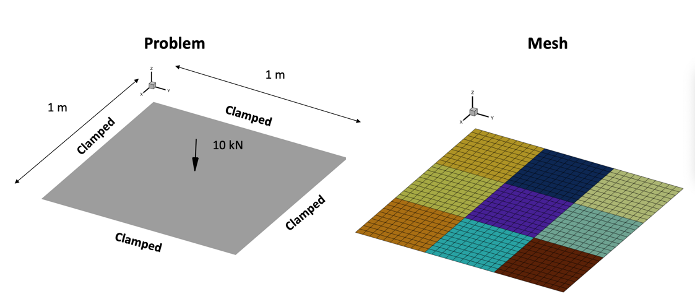

Plate under static load
***********************

This problem will show how to use some of pytacs more advanced load setting procedures.
The nominal case is a 1m x 1m flat plate. The perimeter of the plate is fixed in
all 6 degrees of freedom. The plate comprises 900 CQUAD4 elements.
We consider a static case where a 10 kN point force is applied at the plate center.

First, import required libraries:

.. code-block:: python

  import numpy as np
  from tacs import functions, constitutive, elements, pyTACS

This class will initialize the model in TACS with constitutive
properties and design variables, then generate the ParOpt
problem to be optimized.

At minimum, :class:`~tacs.pytacs.pyTACS` requires a NASTRAN bdf defining nodes, elements, and boundary conditions.
Including property cards in the bdf file is optional, as they can also be defined in the
:meth:`pyTACS.initialize <tacs.pytacs.pyTACS.initialize>` method, as we'll see later in this example.

.. code-block:: python

  bdfFile = './plate.bdf'
  FEAAssembler = pyTACS(bdfFile)

Callback function used to setup TACS element objects and design variables :func:`~tacs.pytacs.elemCallBack`.

.. code-block:: python

  def elemCallBack(dvNum, compID, compDescript, elemDescripts, specialDVs, **kwargs):
      # Material properties
      rho = 2500.0        # density kg/m^3
      E = 70e9            # Young's modulus (Pa)
      nu = 0.3            # Poisson's ratio
      ys = 464.0e6        # yield stress

      # Plate geometry
      tplate = 0.005    # 5 mm
      tMin = 0.0001    # 0.1 mm
      tMax = 0.05     # 5 cm

      # Set up material properties
      prop = constitutive.MaterialProperties(rho=rho, E=E, nu=nu, ys=ys)
      # Set up constitutive model
      con = constitutive.IsoShellConstitutive(prop, t=tplate, tNum=dvNum, tlb=tMin, tub=tMax)
      # Set the transform used to define shell stresses, None defaults to NaturalShellTransform
      transform = None
      # Set up tacs element for every entry in elemDescripts
      # According to the bdf file, elemDescripts should always be ["CQUAD4"]
      elemList = []
      for descript in elemDescripts:
          if descript == 'CQUAD4':
              elem = elements.Quad4Shell(transform, con)
          else: # Add a catch for any unexpected element types
              raise ValueError(f"Unexpected element of type {descript}.")
      return elemList

See :class:`~tacs.constitutive.MaterialProperties`, :class:`~tacs.constitutive.IsoShellConstitutive`,
and :class:`~tacs.elements.Quad4Shell` for more information.

Set up constitutive objects and elements, :meth:`pyTACS.initialize <tacs.pytacs.pyTACS.initialize>`.

.. code-block:: python

  FEAAssembler.initialize(elemCallBack)

Create static problem :meth:`pyTACS.createStaticProblem <tacs.pytacs.pyTACS.createStaticProblem>`.

.. code-block:: python

  staticProb = FEAAssembler.createStaticProblem(name='point_force')

Add functions using :meth:`StaticProblem.addFunction <tacs.problems.StaticProblem.addFunction>`,
:class:`~tacs.functions.StructuralMass`, :class:`~tacs.functions.KSFailure`.

.. code-block:: python

  staticProb.addFunction('mass', functions.StructuralMass)
  staticProb.addFunction('ks_vmfailure', functions.KSFailure, ksWeight=100.0)

Add a point load to the center of the plate :meth:`StaticProblem.addLoadToNodes <tacs.problems.StaticProblem.addLoadToNodes>`.

.. code-block:: python

  F = np.array([0.0, 0.0, 1e4, 0.0, 0.0, 0.0])
  staticProb.addLoadToNodes(481, F, nastranOrdering=True)

Solve problem and evaluate functions, :meth:`StaticProblem.solve <tacs.problems.StaticProblem.solve>` and
:meth:`StaticProblem.evalFunctions <tacs.problems.StaticProblem.evalFunctions>`.

.. code-block:: python

  funcs = {}
  problem.solve()
  problem.evalFunctions(funcs)

Evaluate functions sensitivity :meth:`StaticProblem.evalFunctionsSens <tacs.problems.StaticProblem.evalFunctionsSens>`.

.. code-block:: python

  funcsSens = {}
  problem.evalFunctionsSens(funcsSens)