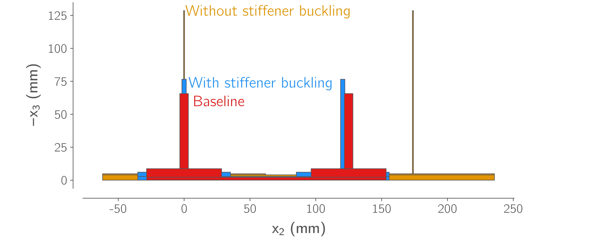

# Stiffened plate optimization example

A simple example of optimizing a stiffened panel using the blade-stiffened shell constitutive model.
We will optimize the sizing of the plate and its stiffeners to minimize mass subject to the material and buckling failure criteria included in the `BladeStiffenedShellConstitutive` and `GPBladeStiffenedShellConstitutive` constitutive models.

This example is based on the composite panel design example example in section 13.2 of "Design and Analysis of Composite Structures with Applications to Aerospace Structures" by Christos Kassapoglou.
The task is to size a 0.75 x 1.5m stiffened panel based on 2 loadcases:

- Uniform pressure of 62,500 Pa
- Applied in-plane loads Nx = −350 N/mm, Nxy = 175 N/mm

The panel should not fail in either load case and the out-of-plane deflection should be less than 10mm under the pressure load.

## Example

The following commands will optimize the plate using the following design variables:

- Panel thickness
- Stiffener thickness
- Stiffener height
- Stiffener pitch
- Panel ply fractions

We compare the optimized stiffener cross sections found with and without the inclusion of the stiffener buckling failure criteria.

```bash
python optimize_stiffened_plate.py --useStiffPitchDV --usePlyFracDV --includeStiffenerBuckling --output WithStiffenerBuckling
python optimize_stiffened_plate.py --useStiffPitchDV --usePlyFracDV --output WithoutStiffenerBuckling
```

Then, to plot the stiffener cross sections, run:

```bash
python CompareCrossSections.py
```

The results should look something like this:

```
Quantity                    Without stiffener buckling    With stiffener buckling    Baseline
--------------------------  ----------------------------  -------------------------  -------------------
Skin thickness              3.956                         2.747                      2.172
Skin ply fractions          [ 10% 40% 40% 10% ]           [ 10% 40% 40% 10% ]        [ 14% 36% 36% 14% ]
Stiffener thickness         0.8204                        3.288                      6.477
Stiffener height            123.8                         70.48                      57
Stiffener pitch             173.8                         120.5                      125
Stiffener web aspect ratio  150.9                         21.44                      8.8
In-plane FOS                1.5                           1.5                        0.7502
Pressure FOS                1.949                         1.5                        1.811
Max displacement            10                            10                         9.166
Mass                        9.277                         11.94                      14.62
```


